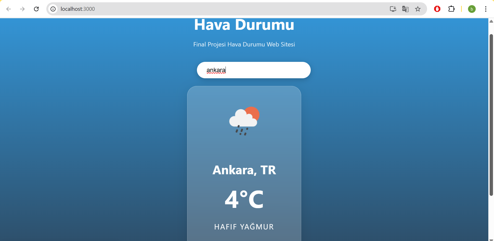
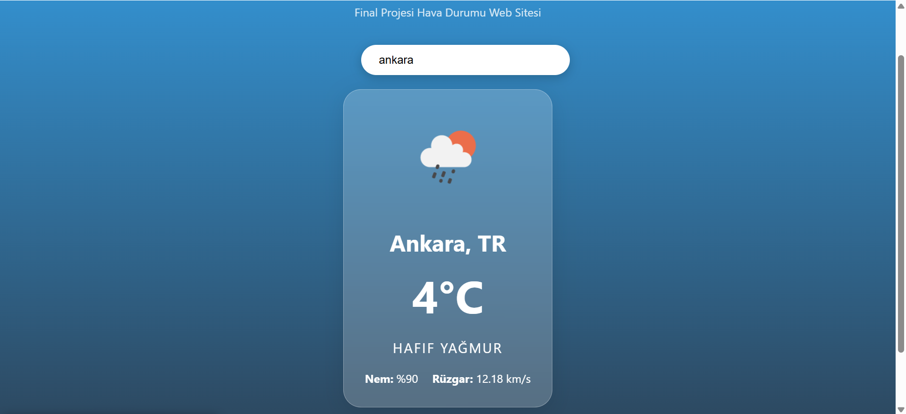

# Final Ödevi

Bu proje React kullanılarak geliştirilmiş dinamik bir Hava Durumu Uygulamasıdır. Kullanıcıdan alınan şehir ismine göre OpenWeather API üzerinden verileri anlık olarak çeker.

##  Proje Özellikleri
- **API Kullanımı:** OpenWeatherMap API kullanılarak gerçek zamanlı veri çekilmiştir.
- **Dinamik Tasarım:** Hava durumuna göre (Güneşli, Bulutlu, Yağmurlu, Karlı) arka plan rengi ve ikonlar otomatik değişir.
- **Bileşen Yapısı:** Proje; Header, Content ve Footer olmak üzere 3 ana bileşenden oluşur.
- **Kullanıcı Deneyimi:** Hatalı şehir girişlerinde uyarı mesajı ve veri yüklenirken "Yükleniyor..." bildirimi eklenmiştir.

## Kullanılan API
- 3adf9c89d798a8f7847571d266ede518 (https://openweathermap.org/)

## Nasıl Çalıştırılır?
1. Bu klasörü bilgisayarınıza indirin.
2. Terminali klasör içinde açın.
3. `npm install` komutu ile kütüphaneleri kurun.
4. `npm start` komutu ile uygulamayı tarayıcıda görüntüleyin.
5. Klasördeki `build` klasörü üzerinden de projenin çıktısına ulaşılabilir.

## Ekran Görüntüsü
# Aşağıdaki görüntüde anasayfa bulunmaktadır

# İkinci görüntü ise nem ve rüzgar bilgisini içermektedir

---
**Hazırlayan:** Beyza Kızılay 